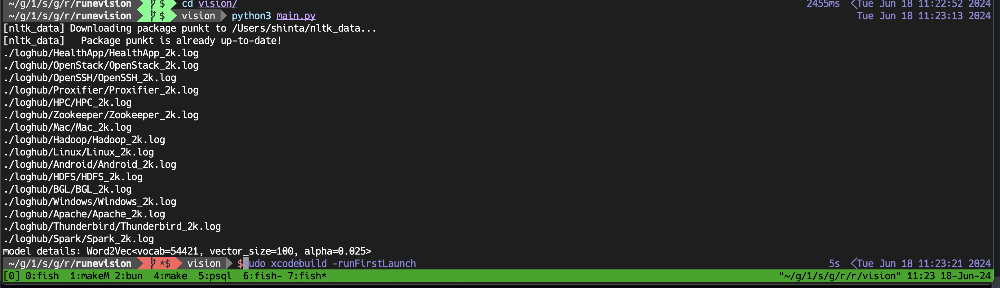

## vision
vision model is a reinforcement learning algorithm for proper exploitation in runevision using word2vec and logs from loghub

## training
python3 main.py

result

## requirements
- Python 3.9.6